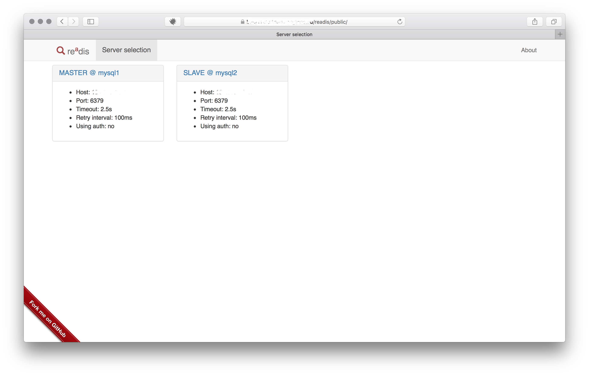
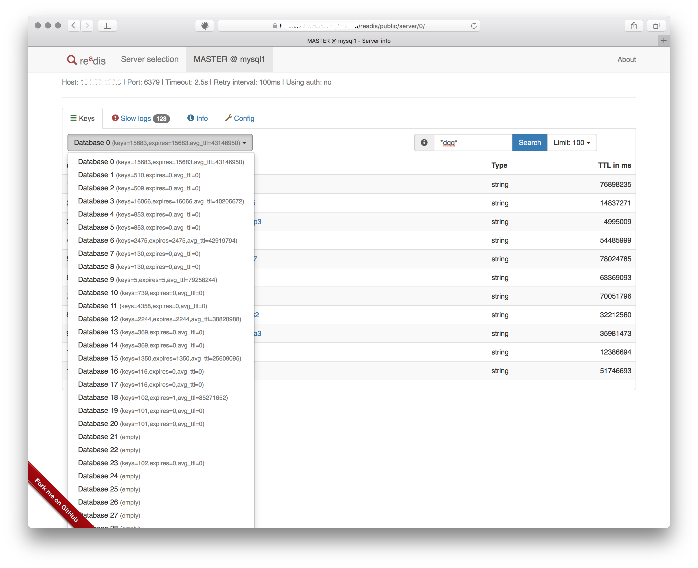
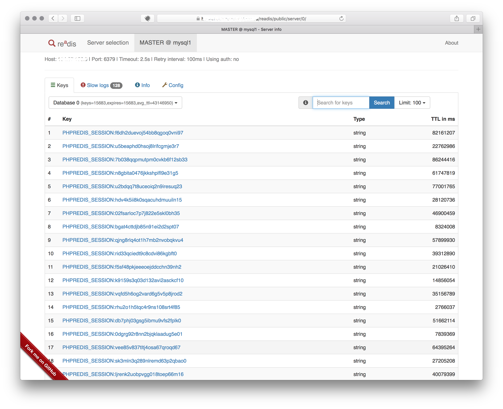
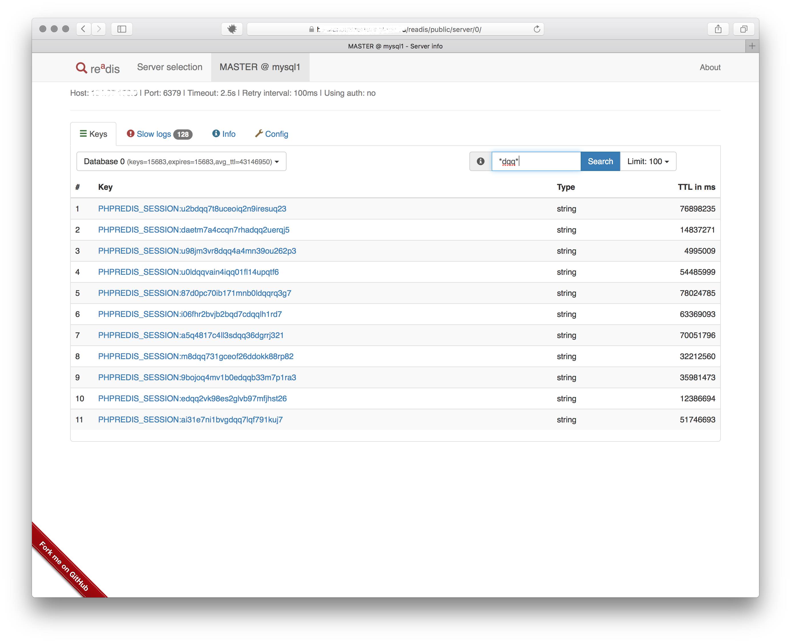
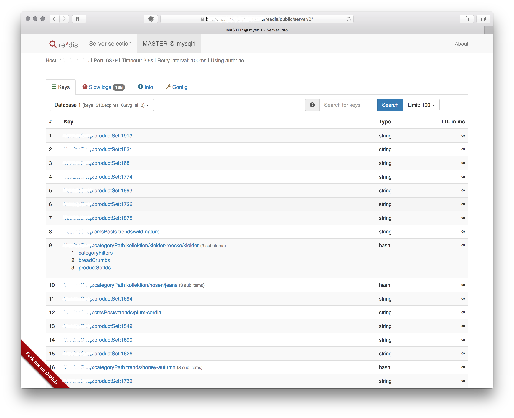
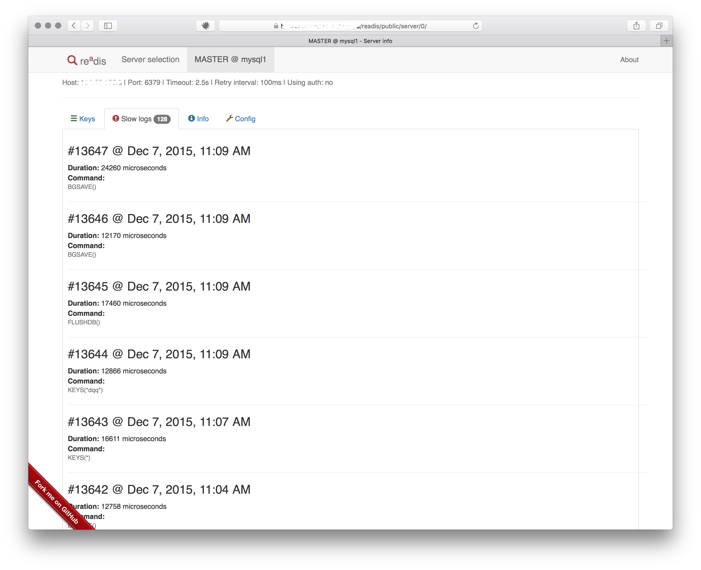
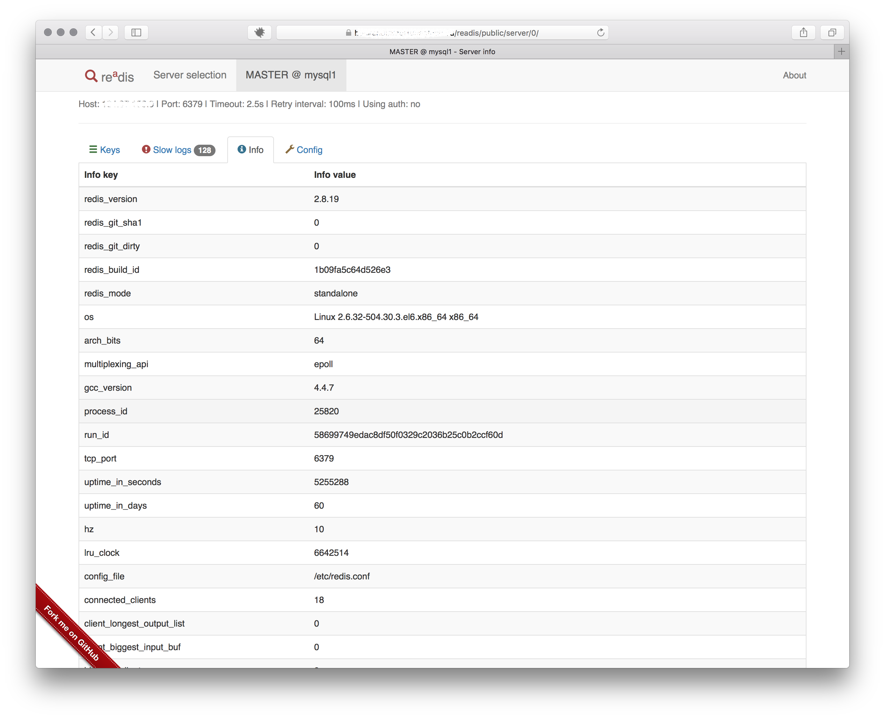
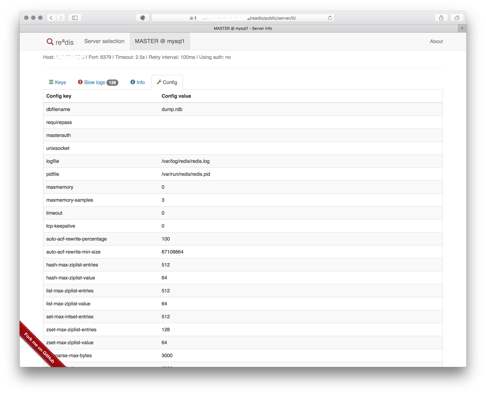

[](https://packagist.org/packages/hollodotme/readis) 
[](https://packagist.org/packages/hollodotme/readis) 
[](https://packagist.org/packages/hollodotme/readis) 
[](https://packagist.org/packages/hollodotme/readis)

# readis

A web interface to read data from redis server(s)

## Features

 * Setup / Selection for multiple redis servers
 * Selection of a database inside a redis server
 * Searching for keys (with placeholders) inside a database
 * Listing of found keys with variable limit
 * Basic information about keys
 * Viewing the content of keys and hash keys
 * Listing of slow logs
 * Table with all the current server instance information / stats
 * Table with all the current server configs

## Requirements

 * Webserver (nginx, apache2, etc.)
 * PHP >= 5.5 with phpredis extension (**compatible with php7**)

## Installation

Assuming you'll install readis under `/var/www/readis` on your server.

1. SSH into your webserver.
2. `$ git clone https://github.com/hollodotme/readis.git /var/www/readis`
3. `$ cd /var/www/readis`
4. `$ git checkout v1.0.0`
5. `$ sh build/tools/update_tools.sh`
6. `$ php build/tools/composer.phar update -o -v`
7. `$ cp config/app.sample.php config/app.php`
8. Set up the baseUrl in `config/app.php` (Should be the full http-URL with path, **without trailing slash**) 
9. `$ cp config/servers.sample.php config/servers.php`
10. Set up all server instances in `config/servers.php`
11. Set up your webserver having a VHost pointing to `/var/www/readis/public`  
See the following nginx example config:

```
server {
	listen 80;
	
	# Change the domain name
	server_name www.your-domain.net;

	root /var/www/readis/public;
	index index.php;

	location / {
		try_files $uri $uri/ /index.php?$args;
	}

	location ~ \.php$ {
		fastcgi_split_path_info ^(.+\.php)(/.+)$;
		fastcgi_pass unix:/var/run/php5-fpm.sock;
		fastcgi_index index.php;
		include fastcgi_params;
	}
}
```

**That's it.**

## Public demo

**[Browse the demo](http://readis.hollo.me)**

## Screenshots

## Server selection

[](screenshots/Server-Selection.png)

## Database selection

[](screenshots/Database-Selection.png)

## Key overview

[](screenshots/Key-Overview.png)

## Key search result

[](screenshots/Key-Search-Result.png)

## HashKey collapse

[](screenshots/Hash-Key-Collapse.png)

## Slow Logs

[](screenshots/Slow-Logs.png)

## Server information

[](screenshots/Server-Info.png)

## Server config

[](screenshots/Server-Config.png)